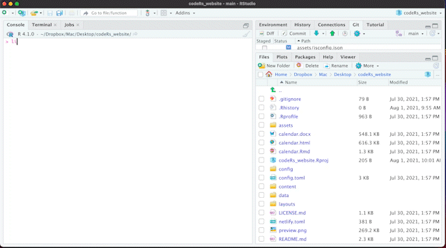

# Hi & Welcome! :smiley:&#8205; &#128187;

This repo consists of all the material from our UNSW CodeRs workshop on how to build a website using the Blogdown package :package:. 

This workshop invites R users with basic/intermediate knowledge who are interested in learning how to build their personal website using the Blogdown package (No prior knowledge with Blogdown is required). This workshop will be an interactive presentation, where we will build a website together from scratch. We will also provide further resources that will allow you to continue enhancing your website on your own. Please make sure you have R, RStudio and git installed on your computer, and a GitHub account.

  

Participants should have before starting the workshop: 
- R and RStudio installed
- Git installed
- Github account

:books: Additional resources: 
- :link: A [blog post by Jenny Sloane](https://jennysloane.netlify.app/project/blogdown/) that will walk you through every step to build you first academic website with Blogdown.
- :link: Our [slides](https://github.com/UNSW-codeRs/Blogdown-Workshop/blob/main/Introduction_Blogdown.pptx) that explain the background to Blogdown: 
- :link: Check out our [Youtube](https://www.youtube.com/channel/UC9Sm1qcdzyGVjQMgWsW4pcw/playlists) playlist. It includes all the basics that we cover in our workshop and SO MUCH MORE!

  

